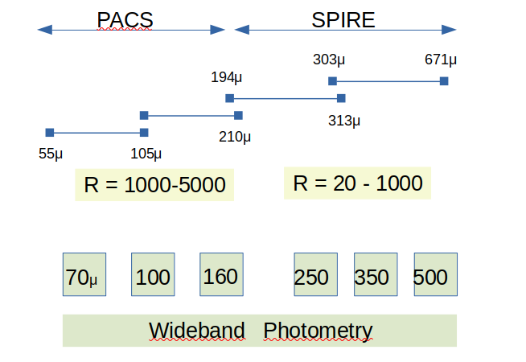

# herplot

Some simple plotting in Hershel level2 data using python3

## Software

To explore the data we will discuss here it will be useful to have (not all components have been identified):

   * python3, ideally with jupyter notebook. E.g via anaconda3 (matplotlib etc. of course are a given)
   * maybe pyspeckit (TBD)
   * ds9, and optionally the xpa tools (also via SAMP)
   * fv (from the ftools package)
   * maybe APLPY if we're going to make fancy plots
   * TopCat (using SAMP)
   * Aladin (using SAMP)

## Hershel (2009-2013)

There were 3 instruments on Hershel

* HIFI (S: single pixel  157 to 625 um or 480-1910 GHz)  - 7 bands [R=1e6-1e7])
* PACS (I: 70, 100, 160   P: 194-672 um    + S:  55-105 ('blue') and 105-210 ('red') um (R=1000-5000))
* SPIRE (P: 250, 350, 500 um + FTS:  194-318 ('SSW') um  and 294-671 ('SLW') um [R=20-1000])

For the purpose of the range of things were are doing here, we only look at SPIRE and PACS

### Observing Modes

* SpirePhotoLargeScan
* SpirePacsParellel
* PacsLineSpec
* PacsPhoto
* SpireSpectroPoint

### Downloading data from HSA

Downloading is preferred in HSA.  When you untar, dont keep the top level , it might be something like
  AIOURL284368565/    or   anonymous284368565/
  
Inside of this is the obsid (a 10-digit number like 1342199746) directory.
Inside of that is the level2 (and perhaps others) directory. We will only need the level2.  If you use the
URL in the CSV file, you will get the whole shebang. Going manually is better, and click the download button,
pick the level2 only, and it will download one of those anonymous tar files.

### Example processing

A notebook for [NGC 4321](ngc4321.ipynb) is used to show examples what can be done with these files.

### SPIRE spectra

The short 194-318 um (944-1568 GHz) is labeled "SS".  E.g. SSWA1 , they refer to a position on the sky
The long  294-671 um (446-1017 GHz) is labeled "SL".  E.g  SLWC4

            SpectrometerDetectorSpectrum     SpectrometerPointSourceSpectrum        numChans
      SL           19 positions                       7                               1905
      SS           35                                17                               2082
     units       ~1e-19                              ~1

### PACS

## Links

* https://www.cosmos.esa.int/web/herschel
* https://www.cosmos.esa.int/web/herschel/data-products-overview
  * PACS: http://herschel.esac.esa.int/hcss-doc-15.0/load/pdd/html/PACSproducts.html
  * SPIRE: http://herschel.esac.esa.int/hcss-doc-15.0/load/pdd/html/SPIREproducts.html
* HSA: http://archives.esac.esa.int/hsa/whsa/
* https://www.cosmos.esa.int/web/herschel/user-contributed-software
* pyspeckit:  https://pyspeckit.readthedocs.io/en/latest/index.html
